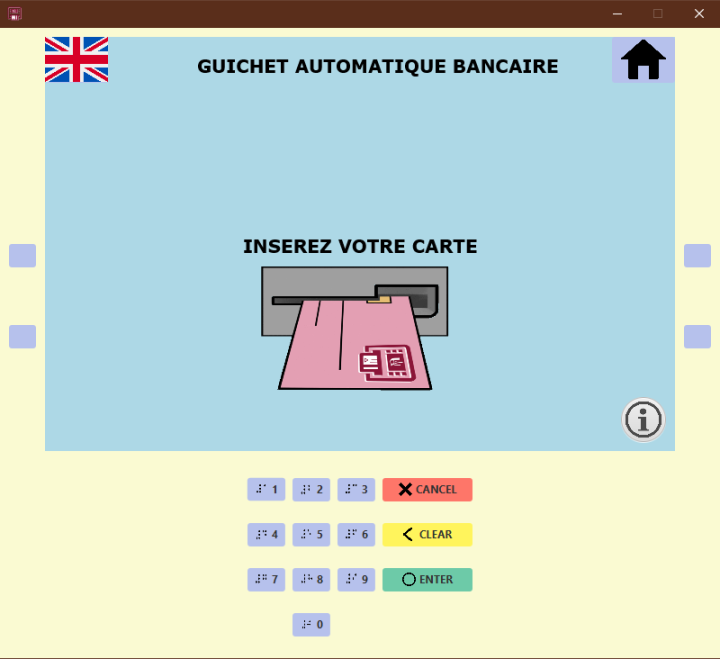
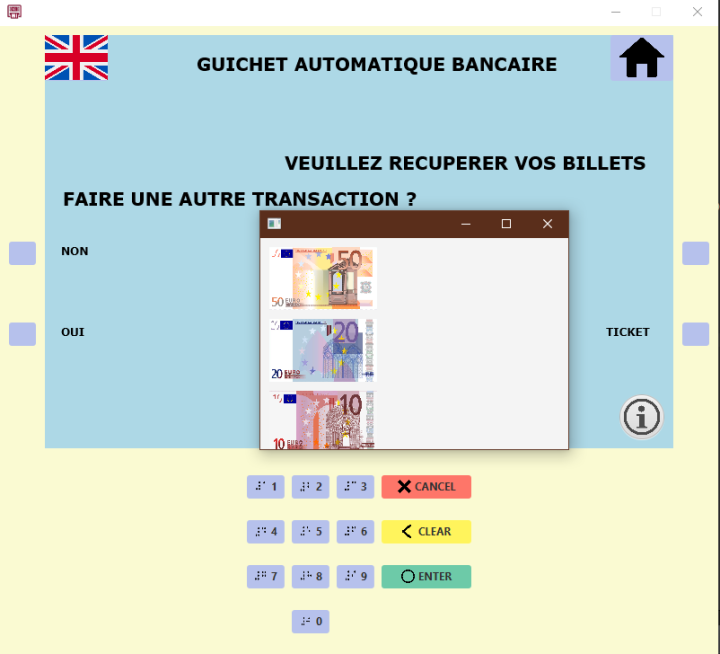
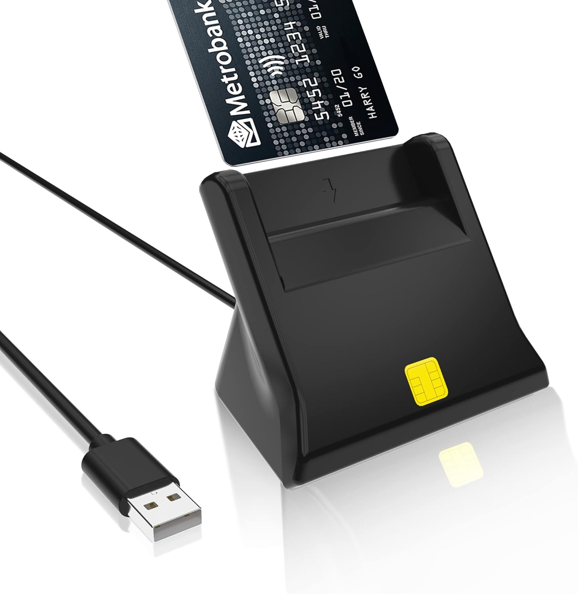
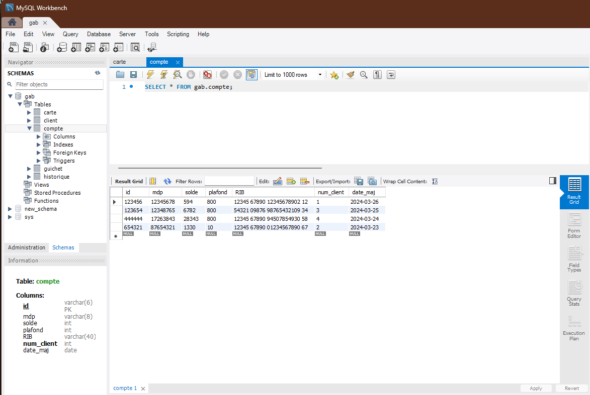

# ATM Project

## Introduction

This **ATM project** is a banking terminal application that allows users to perform basic transactions such as withdrawals, deposits, and balance inquiries using a Java application. It includes additional features to assist visually impaired users through **text-to-speech** and **speech recognition** functionalities.

[Link to the demo (in French)](https://up75-my.sharepoint.com/personal/imane_barahimi_etu_u-paris_fr/_layouts/15/stream.aspx?id=%2Fpersonal%2Fimane_barahimi_etu_u-paris_fr%2FDocuments%2Fdemo%2Emp4&nav=eyJyZWZlcnJhbEluZm8iOnsicmVmZXJyYWxBcHAiOiJPbmVEcml2ZUZvckJ1c2luZXNzIiwicmVmZXJyYWxBcHBQbGF0Zm9ybSI6IldlYiIsInJlZmVycmFsTW9kZSI6InZpZXciLCJyZWZlcnJhbFZpZXciOiJNeUZpbGVzTGlua0NvcHkifX0&ga=1&referrer=StreamWebApp%2EWeb&referrerScenario=AddressBarCopied%2Eview%2E5fe7314a-0bb6-4b31-ac45-41e3537f6074)

## Technologies Used

- **Java**: Core programming language
- **JavaFX**: Used for the graphical user interface (GUI)
- **CMUSphinx**: For speech recognition
- **MySQL Workbench**: For managing the database

## Smart Card Reader Integration

The program operates with a **smart card reader** that is managed using the `javax.smartcardio` package. This reader is used to authenticate users by reading chip cards.

## Database Setup

In order to run the program, you must first create a **mock database** that contains a set of card credentials. These can include blank cards (such as transportation cards, expired bank cards, etc.).

## Security Considerations

Please note that in the current version of this project, the database access credentials (usernames and passwords) are stored in plain text within the `Database` class. This is because the project is designed for educational purposes only.

Additionally, the methods used to hash passwords, such as **SHA-256** and **MD5**, are not considered secure enough for production environments. Both methods are vulnerable to attacks, and a more robust encryption approach should be implemented in future versions.

## Known Issues

There are several dependency-related issues that need to be addressed for the program to work smoothly. These include:

- Managing external libraries and versions properly to avoid conflicts.
  
## Improvements

Some planned improvements for the project include:

- Enhancing the interface to make it more **intuitive** and **responsive**.
- Fixing thread-related errors in the speech recognition functionality.
- Improving security by properly securing database credentials and implementing stronger password hashing methods.
- Making the project fully exportable as a standalone application to avoid dependency conflicts.
- ... to be continued.

## Contributors

- [Imane Barahimi](https://github.com/imane-21)
- [Clara Ait Mokhtar](https://github.com/claraait123)

---

